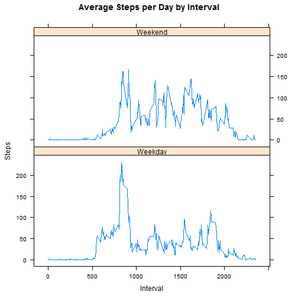

## Loading and preprocessing the data
### Requirements:
 1. Load the data (i.e. read.csv())
 2. Process/transform the data (if necessary) into a format suitable for your analysis

### Solutions:
* Set working directory and load data
* Calculate the number of steps for each day
* Print the first 20 lines of the formated dataset

  
  ```r
  	setwd("C:/Users/jchen.RESPONSYS/Downloads/repdata-data-activity")
  	actData <- read.csv("activity.csv")
  	steps_by_day <- aggregate(steps ~ date, actData, sum)
  	print(actData[1:20,])
  ```
  
  ```
  ##    steps       date interval
  ## 1     NA 2012-10-01        0
  ## 2     NA 2012-10-01        5
  ## 3     NA 2012-10-01       10
  ## 4     NA 2012-10-01       15
  ## 5     NA 2012-10-01       20
  ## 6     NA 2012-10-01       25
  ## 7     NA 2012-10-01       30
  ## 8     NA 2012-10-01       35
  ## 9     NA 2012-10-01       40
  ## 10    NA 2012-10-01       45
  ## 11    NA 2012-10-01       50
  ## 12    NA 2012-10-01       55
  ## 13    NA 2012-10-01      100
  ## 14    NA 2012-10-01      105
  ## 15    NA 2012-10-01      110
  ## 16    NA 2012-10-01      115
  ## 17    NA 2012-10-01      120
  ## 18    NA 2012-10-01      125
  ## 19    NA 2012-10-01      130
  ## 20    NA 2012-10-01      135
  ```

## What is mean total number of steps taken per day?
### Requirements:
1. Make a histogram of the total number of steps taken each day
2. Calculate and report the mean and median total number of steps taken per day

### Solutions:
* Plot histogram
* Calculate mean and median

  
  ```r
  	hist(steps_by_day$steps, main = paste("Steps Each Day"), col="blue", xlab="Number of Steps")
  ```
  
   
  
  ```r
  	rmean <- mean(steps_by_day$steps)
  	rmedian <- median(steps_by_day$steps)
  ```
The `mean` is 1.0766189 &times; 10<sup>4</sup> and the `median` is 10765.

## What is the average daily activity pattern?
### Requirements:
1. Make a time series plot (i.e. type = "l") of the 5-minute interval (x-axis) and the average number of steps taken, averaged across all days (y-axis)
2. Which 5-minute interval, on average across all the days in the dataset, contains the maximum number of steps?

### Solutions:
* Calculate avg steps for every day by every intervals 
* Plot the Avg Steps by Interval. 
* Find interval with max average steps. 

  
  ```r
  	steps_by_interval <- aggregate(steps ~ interval, actData, mean)
  	plot(steps_by_interval$interval,steps_by_interval$steps, type="l", xlab="Interval", ylab="Number of Steps",main="Avg Steps per Day by Interval")
  ```
  
   
  
  ```r
  	max_interval <- steps_by_interval[which.max(steps_by_interval$steps),1]
  ```

The 5-minute interval, on average across all the days in the data set, containing the maximum number of steps is 835.

## Imputing missing values
### Requirements:
1. Calculate and report the total number of missing values in the dataset (i.e. the total number of rows with NAs)
2. Devise a strategy for filling in all of the missing values in the dataset. The strategy does not need to be sophisticated. For example, you could use the mean/median for that day, or the mean for that 5-minute interval, etc.
3. Create a new dataset that is equal to the original dataset but with the missing data filled in.
4. Make a histogram of the total number of steps taken each day and Calculate and report the mean and median total number of steps taken per day. Do these values differ from the estimates from the first part of the assignment? What is the impact of imputing missing data on the estimates of the total daily number of steps?

### Solutions:
* Missing values will be filled by the average for each interval. For example, if 10-01-2012 interval 0 was missing, it'll be filled by the average for that interval for all days. 
  
  ```r
  	imputedData <- transform(actData, steps = ifelse(is.na(actData$steps), steps_by_interval$steps[match(actData$interval, steps_by_interval$interval)], actData$steps))
  ```

* Recount total steps by day and create Histogram. 
  
  ```r
  	steps_by_day1 <- aggregate(steps ~ date, imputedData, sum)
  	hist(steps_by_day1$steps, main = paste("Steps Each Day"), col="red", xlab="Number of Steps")
  	hist(steps_by_day$steps, main = paste("Steps Each Day"), col="blue", xlab="Number of Steps",add=T)
  	legend("topright", c("Imputed", "Non-imputed"), col=c("red", "blue"), lwd=10)
  ```
  
   

* Calculate new mean and median for imputed data. 
  
  ```r
  	rmean1 <- mean(steps_by_day1$steps)
  	rmedian1 <- median(steps_by_day1$steps)
  ```

* Calculate difference between imputed and non-imputed data.
  
  ```r
  	mean_diff <- rmean1 - rmean
  	median_diff <- rmedian1 - rmedian
  ```

Calculate total difference.
  
  ```r
  	total_diff <- sum(steps_by_day1$steps) - sum(steps_by_day$steps)
  ```
* The imputed data mean is 1.0766189 &times; 10<sup>4</sup>
* The imputed data median is 1.0766189 &times; 10<sup>4</sup>
* The difference between the non-imputed mean and imputed mean is 0
* The difference between the non-imputed mean and imputed mean is 1.1886792
* There were 8.6129509 &times; 10<sup>4</sup> more steps in the imputed data. 

## Are there differences in activity patterns between weekdays and weekends?
### Requirements:
1. Create a new factor variable in the dataset with two levels -- "weekday" and "weekend" indicating whether a given date is a weekday or weekend day.
2. Make a panel plot containing a time series plot (i.e. type = "l") of the 5-minute interval (x-axis) and the average number of steps taken, averaged across all weekday days or weekend days (y-axis). The plot should look something like the following, which was created using simulated data:

### Solutions:
*Create a day column to identify weekdays and weekends. Plot activities of weekdays and weekends stack together. 
* From the plot, there are more activities in weekday morning and more whole day activities in weekends.

  
  ```r
  	weekdays <- c("Monday", "Tuesday", "Wednesday", "Thursday", "Friday")
  	imputedData$day = as.factor(ifelse(is.element(weekdays(as.Date(imputedData$date)),weekdays), "Weekday", "Weekend"))
  	steps_by_interval1 <- aggregate(steps ~ interval + day, imputedData, mean)
  	library(lattice)
  	xyplot(steps_by_interval1$steps ~ steps_by_interval1$interval|steps_by_interval1$day, main="Average Steps per Day by Interval",xlab="Interval", ylab="Steps",layout=c(1,2), type="l")
  ```
  
   
